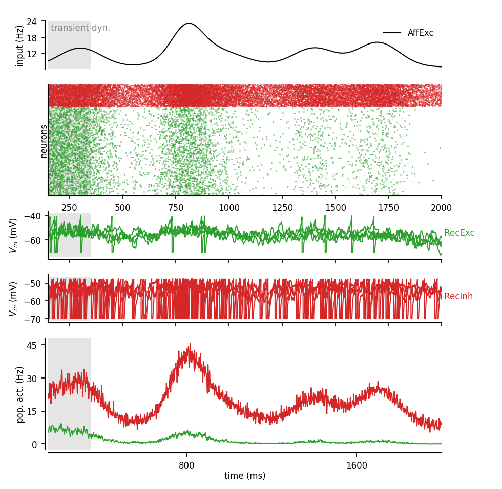

# Neural Network Dynamics

*Theoretical analysis and numerical simulations to study the emergent dynamics in spiking neural networks*

Network simulations toolkit built as a layer on top of the [brian2 simulator](https://brian2.readthedocs.io/en/stable/).

## Aim 

Build a module that would put under a common framework the following aspects of neural network dynamics:

- perform numerical simulations of networks of Adexp single neuron models
- customize network and cellular features such as connectivity matrices or intrinsic currents
- compute mean-field predictions of network dynamics
- investigate cellular integration in morphologically-detailed models


## Installation

Using `git` to clone the repository and "pip" to install the package in your python environment:

```
git clone https://github.com/yzerlaut/neural_network_dynamics.git
pip install -r neural_network_dynamics/requirements.txt
```

Note you might want to use the code compilation to C code for speed, so you will need the `gcc` compiler, e.g. on ubuntu/debian, get it with:
```
sudo apt install build-essential
```


## Usage

```
import numpy as np
import matplotlib.pylab as plt

import ntwk # THIS MODULE

# write your model details/parameters in a dictionary (N.B unit system is : ms, mV, pF, nS, pA, Hz)
Model = {
    # numbers of neurons in population
    'N_Exc':4000, 'N_Inh':1000, 'N_AffExc':400,
    # synaptic weights
    'Q_Exc_Exc':1., 'Q_Exc_Inh':1., 
    'Q_AffExc_Exc':1., 'Q_AffExc_Inh':1., 
    'Q_Inh_Exc':4., 'Q_Inh_Inh':4., 
    # synaptic time constants
    'Tse':5., 'Tsi':5.,
    # synaptic reversal potentials
    'Ee':0., 'Ei': -80.,
    # connectivity parameters
    'p_Exc_Exc':0.05, 'p_Exc_Inh':0.05, 
    'p_Inh_Exc':0.05, 'p_Inh_Inh':0.05, 
    'p_AffExc_Exc':0.5, 'p_AffExc_Inh':0.5, 
    # simulation parameters
    'dt':0.1, 'tstop': 1500., 'SEED':3, # low by default, see later
    ## ---------------------------------------------------------------------------------
    # === cellular properties (based on AdExp), population by population ===
    # --> Excitatory population (Exc, recurrent excitation)
    'Exc_Gl':10., 'Exc_Cm':200.,'Exc_Trefrac':5.,
    'Exc_El':-70., 'Exc_Vthre':-50., 'Exc_Vreset':-70., 'Exc_deltaV':2.,
    'Exc_a':0., 'Exc_b': 40., 'Exc_tauw':500,
    # --> Inhibitory population (Inh, recurrent inhibition)
    'Inh_Gl':10., 'Inh_Cm':200.,'Inh_Trefrac':5.,
    'Inh_El':-70., 'Inh_Vthre':-50., 'Inh_Vreset':-70., 'Inh_deltaV':0.5,
    'Inh_a':0., 'Inh_b': 0., 'Inh_tauw':1e9,
}

t_array = ntwk.arange(int(Model['tstop']/Model['dt']))*Model['dt']

# build the model
NTWK = ntwk.build.populations(Model, ['Exc', 'Inh'],
                              AFFERENT_POPULATIONS=['AffExc'],
                              with_raster=True, with_Vm=4,
			      verbose=True)
ntwk.build.recurrent_connections(NTWK, SEED=5, verbose=True)
Faff_array = 4.+4*np.exp(-(t_array-1000)**2/2/100**2) # afferent input
# afferent excitation onto cortical excitation and inhibition
for i, tpop in enumerate(['Exc', 'Inh']): # both on excitation and inhibition
    ntwk.stim.construct_feedforward_input(NTWK, tpop, 'AffExc',
                                          t_array, Faff_array,
					  verbose=True, SEED=32)
# initialize
ntwk.build.initialize_to_rest(NTWK)
# run
network_sim = ntwk.collect_and_run(NTWK, verbose=True)
# store data
ntwk.recording.write_as_hdf5(NTWK, filename='RS-FS_data.h5')
# plot
fig, AX = ntwk.plots.activity_plots(ntwk.recording.load_dict_from_hdf5('RS-FS_data.h5'))
plt.show()
```

<p align="center">
  
</p>

## Examples/demo

See the [demo folder](./demo/) for more examples


